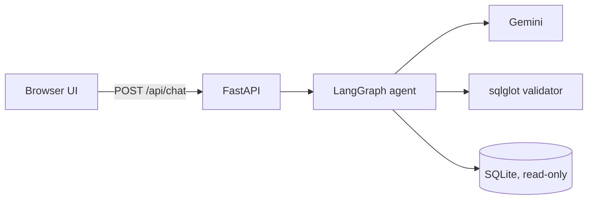
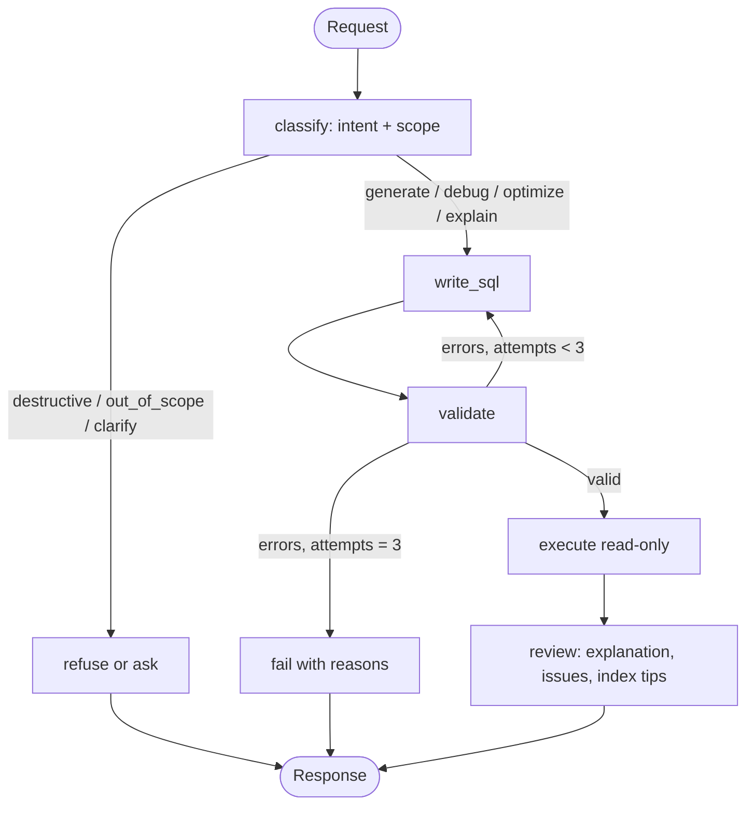

# SQLPilot: natural-language SQL agent (LangGraph)

Translates plain English into validated, read-only SQL for a fixed schema. It also explains, debugs and optimizes SQL, keeps conversation context for follow-ups, and refuses anything outside SQL.

**Live app:** `<add deployed URL>`  |  **Demo video:** `<add link>`  |  No login needed.

## Run locally
```bash
pip install -r requirements.txt
cp .env.example .env            # add GOOGLE_API_KEY (free key from https://aistudio.google.com/apikey)
export $(cat .env | xargs)
uvicorn app.main:app --reload   # http://localhost:8000
pytest                          # validator tests, no API key needed
```
Docker: `docker build -t sqlpilot . && docker run -p 8000:8000 -e GOOGLE_API_KEY=... sqlpilot`

Deploy: push to GitHub, create a Docker web service on Render, Railway or Cloud Run, set `GOOGLE_API_KEY`. The SQLite DB is created from `app/schema.sql` on first start.

## Architecture


## Workflow

- **classify**: a regex catches obvious destructive statements before any LLM call; otherwise the LLM returns one intent. Follow-ups count as in scope because the last SQL is in the prompt.
- **write_sql**: one node, task chosen by intent. Generate modifies `last_sql` for follow-ups; debug and optimize work on the user's SQL.
- **validate** (the main guardrail, no LLM): sqlglot parse, single statement, SELECT only, tables and columns exist in the schema, joins have conditions and follow foreign keys, then `EXPLAIN` on SQLite. Errors go back to `write_sql` for up to 3 attempts.
- **execute**: read-only SQLite connection, 100-row cap, 3 s timeout. Only for the SQLite dialect.
- **review**: plain-English explanation, what was wrong, performance and `CREATE INDEX` suggestions. This merges the brief's "optimization" and "explanation" steps into one call.
- **Context**: a LangGraph `MemorySaver` keyed by session id stores `history` and `last_sql`; per-turn fields are reset each request.

## Guardrails and prompt injection
Safety never depends on the LLM alone. The validator enforces read-only SQL and real tables and columns on every query, user text is wrapped in `<user_request>` tags and declared untrusted, and the DB connection is opened read-only. Prompts are in `app/prompts.py`.

## Assumptions
- The provided schema was not in the PDF, so `app/schema.sql` is a stand-in (Departments, Employees, Customers, Products, Orders, OrderItems). Replace it with the real one and delete `app/sample.db`.
- PostgreSQL and MySQL are supported for generation and validation only; execution runs on SQLite.
- Join validation only allows equality joins along declared foreign keys.
- Sessions are in memory and reset on restart. Replies are not streamed.
